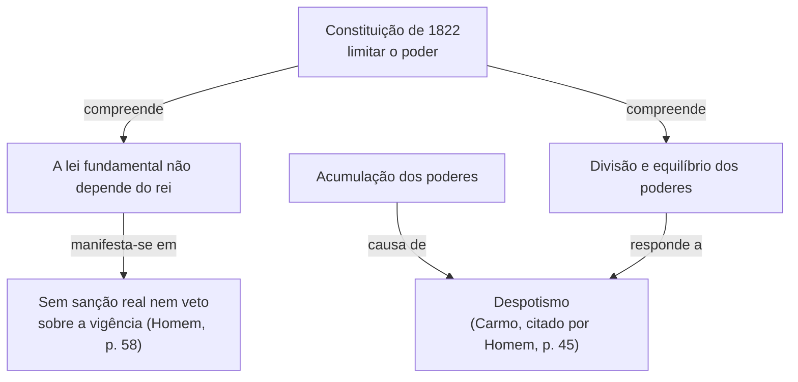

# Anexo A. Modelo da sebenta e exemplo completo

## 1. Modelo, rubrica a rubrica

Todas as rubricas são títulos estruturados do documento. O título do tema é de nível 1, as rubricas (Contextualização, partes, Cronologia, Esquema-síntese, Revisão, Referências, Lacunas) são de nível 2 e as subdivisões da revisão são de nível 3.

### Título

O nome do tema, tal como aparece no programa, se existir. Logo abaixo, numa linha, as fontes em que a sebenta se baseia (apelido, ano).

### Contextualização

Um parágrafo de duas a quatro frases que enquadra o tema (tempo, espaço e problema que o atravessa) apenas com o que as fontes dizem, com as palavras-chave a negrito. Segue-se a frase "Nesta temática, pretende-se atingir os seguintes objetivos." e os objetivos em tópicos, cada um a começar pelo verbo a negrito, tal como o docente os formulou. Uma subsecção "O que se espera do estudante" diz como ler as fontes deste tema (que vozes separar, que posições confrontar) e, quando um objetivo admite mais de uma leitura, qual se adotou e porquê (anexo B). Se não houver objetivos fornecidos, formulam-se dois a quatro a partir das fontes, com os verbos do anexo B. Um objetivo que as fontes não cobrem continua na lista, com a indicação "(sem parte própria, ver Lacunas)".

### Desenvolvimento por partes

Uma parte por objetivo, com um título numerado e curto que diga a ideia. A parte segue o percurso da etapa 4 da skill: o problema em voz própria, a tese nas palavras do autor, a explicação (o que quer dizer, provas, contra quem, pressupostos, limites), o confronto ou os conceitos em quadro quando o objetivo os pede, a ponte para a parte seguinte, a nota de atenção e as notas. A frase de abertura nunca anuncia a tese por outras palavras antes de a citar.

A extensão de cada parte segue a profundidade do objetivo, e não um número de páginas.

### Citação em bloco

Uma citação de 40 ou mais palavras entra em parágrafo próprio, recuado, sem aspas, com a referência depois da pontuação final e sem ponto depois do parêntese. Em Markdown, o recuo faz-se com `>` no princípio de cada linha. A frase anterior apresenta o bloco e diz porque é que a formulação inteira importa.

```markdown
Johnson resume o papel de Isaías numa passagem que convém ler inteira, porque liga a mudança religiosa a uma mudança de escala:

> [Citação de 40 ou mais palavras, copiada do banco tal como está na fonte, sem aspas, com reticências sem parênteses retos onde houver omissão.] (Johnson, 1987/1989, p. 84)

A explicação retoma depois o que o bloco diz, sem o repetir por outras palavras.
```

Se o autor e o ano já estiverem na frase que introduz o bloco ("Como escreve Johnson (1987/1989):"), o parêntese final leva só a página, (p. 84).

### Quadro de contraposição

Os quadros servem a comparação e a memorização, e entram sempre que o objetivo os pede. Antes de cada quadro, uma frase diz o que vem a seguir, e depois dele um parágrafo retoma a explicação, porque o quadro organiza mas não explica. Os quadros de contraposição e de conceitos não substituem as notas e o glossário, mas o glossário não repete palavra por palavra as definições do quadro.

Quando duas ou mais teorias, posições, doutrinas ou sistemas se confrontam (liberalismo e absolutismo, capitalismo e comunismo, judaísmo e cristianismo, maximalistas e minimalistas na leitura da Bíblia), um quadro com os critérios de comparação nas linhas e as posições nas colunas. Os critérios escolhem-se pelo objetivo e pelo que as fontes efetivamente comparam. Cada célula diz a posição em poucas palavras e leva a referência, e as células que exigem a formulação exata levam uma citação curta. Uma célula sem apoio nas fontes fica com "não tratado nas fontes", em vez de ser preenchida por conta própria. A frase anterior diz que posições se comparam e segundo que critérios, e o parágrafo seguinte explica o que o confronto ensina.

```markdown
O quadro seguinte compara as duas posições segundo os critérios que as fontes efetivamente discutem.

| Critério | Posição A (Autor, ano) | Posição B (Autor, ano) |
| --- | --- | --- |
| [critério escolhido pelo objetivo] | [posição em poucas palavras ou citação curta] (Autor, ano, p. x) | [posição] (Autor, ano, p. y) |
| [segundo critério] | [posição] (Autor, ano, p. x) | não tratado nas fontes |

[Parágrafo que explica o que o confronto mostra e porque é que cada autor pensa assim.]
```

### Quadro de conceitos

Quando o objetivo é conceptual (formas de mito, tipos de profetismo, modalidades de monoteísmo, conceitos de nação), um quadro com o conceito, a definição no autor (de preferência em citação curta), o exemplo ou o caso que a fonte dá e, quando houver risco de confusão, o deslize a evitar. Cada linha tem a referência.

```markdown
O quadro seguinte reúne as formas de [conceito] que o autor distingue.

| Conceito | Definição no autor | Exemplo na fonte | Deslize a evitar |
| --- | --- | --- | --- |
| [forma 1] | «[citação curta da definição]» (Autor, ano, p. x) | [caso que a fonte dá] (p. x) | [confusão provável] |
| [forma 2] | [definição] (Autor, ano, p. y) | [caso] (p. y) | [confusão provável] |
```

### Caixa "Fora das fontes"

Só para uma falha flagrante que as fontes não resolvem (um erro factual evidente, uma posição datada apresentada como consenso, uma tradução que inverte o sentido). Entra no fim da parte, a começar por "**Fora das fontes.**", e diz em uma ou duas frases qual é a falha da fonte e o que a investigação diz, com a referência de uma obra fiável (de preferência citada diretamente, se o estudante a puder consultar). A referência entra também nas referências finais, e a falha regista-se nas lacunas. A caixa nunca serve para refutar o autor, só para que o estudante não reproduza como consenso o que não é. Fora desta caixa, nenhum nome, data ou facto exterior às fontes entra na sebenta, e o verificador assinala os nomes próprios que não aparecem nas fontes.

```markdown
> **Fora das fontes.** [A falha da fonte, dita sem refutar o autor.] [O que a investigação diz, de preferência em citação curta] (Autor, ano, p. x). [Porque é que o estudante precisa de o saber.]
```

### Notas

Uma nota por conceito-chave ou termo pouco usual, na primeira ocorrência, com chamada em algarismo sobrescrito (¹, ², ³). A nota dá o sentido que o autor estudado dá ao termo, com a referência. Quando a fonte não define o termo, a nota di-lo e indica o uso ("Termo não definido na fonte. Homem usa-o para designar...", com a referência do uso), e o termo entra nas lacunas. Nunca se escreve uma definição sem fonte.

### Notas de atenção

Um bloco de destaque, a começar por "**Atenção.**", em texto normal, no fim da parte onde a confusão pode surgir. Ver o anexo C.

### Cronologia

Rubrica opcional, incluída apenas quando o tema a justificar. É um quadro com as datas que estão nas fontes e são necessárias para compreender o tema. Quando a fonte usa outro sistema de datação (Era de César, Hégira, calendário juliano), o quadro tem uma coluna com a data da fonte e outra com a data convertida, e a conversão vem do dossiê.

### Esquema-síntese

Um diagrama hierárquico e relacional, com o tema no topo, as partes abaixo e os aspetos de cada parte. As setas levam um destes rótulos, e só estes, porque são os do protocolo de leitura e cada um tem uma verificação própria no dossiê.

| Rótulo | Quando se usa |
| --- | --- |
| compreende | Ligação hierárquica entre o tema e as partes, sem relação lógica. |
| causa de, consequência de | Causalidade afirmada pela fonte. |
| condição de | Condição necessária, suficiente ou favorável, como a fonte a apresenta. |
| precede, conduz a | Sucessão temporal sem causalidade afirmada. |
| responde a | Problema e resposta. |
| manifesta-se em | Um processo ou princípio e a prova ou o sinal em que a fonte o reconhece. |
| exemplo de | Caso e conjunto. |
| define, serve para | Conceito e função. |
| contrasta com, opõe-se a | Contraste ou oposição no mesmo âmbito. |
| complementa | Dimensões compatíveis do mesmo objeto. |

O esquema não acrescenta nada que não esteja no desenvolvimento.

### Revisão

A secção de revisão é o que o estudante usa nos dias antes da avaliação, e tem três blocos com títulos de nível 3.

- **Essencial a reter.** Um tópico por objetivo, pela mesma ordem, com etiqueta curta a negrito e uma ou duas frases completas com a ideia central e a sua razão, com a referência. Um último tópico com o limite mais importante a ter presente. Não acrescenta nada que não esteja no desenvolvimento.
- **Glossário.** Os termos das notas, por ordem alfabética, cada um numa linha ("**Termo:** sentido no autor (referência)"), mais curto do que a nota, de modo que se possa usar como cartões.
- **Perguntas de autoavaliação.** Uma ou duas por objetivo, formuladas com o verbo do próprio objetivo (anexo B), cada uma seguida da remissão para a parte onde está a matéria ("ver parte 2"). Não levam resposta-modelo, porque o objetivo é o estudante recuperar a matéria por si. Quando houver fontes primárias, uma das perguntas pede o comentário de um documento segundo o guião do anexo E.

A secção termina com uma frase de orientação para a revisão espaçada, por exemplo responder às perguntas no dia seguinte ao estudo, uma semana depois e na semana da avaliação, conferindo sempre na parte indicada.

### Versão curta

Se o estudante pedir uma revisão rápida, produzir uma versão curta com a contextualização, o esquema, o essencial a reter e as perguntas de autoavaliação, seguidos das notas de atenção reunidas numa lista.

### Referências

Lista em APA 7 das fontes efetivamente usadas, segundo os modelos de `citacoes-apa7.md` da skill `leitura-academica`.

### Lacunas

Só se existirem. O que não foi possível confirmar nas fontes (página em falta, conceito pressuposto mas não definido, tese sem citação confirmada, objetivo sem cobertura, data ausente, texto ilegível), escrito no condicional.

### Formatação

A forma é o que permite rever depressa e navegar no documento.

- **Títulos estruturados.** O título do tema, as secções e as partes são títulos do documento (níveis 1, 2 e 3). Um parágrafo a negrito não é um título.
- **Parágrafos compactos.** Em regra, até quatro frases. Um parágrafo maior é um alarme (há duas ideias, ou elementos paralelos que deviam estar em tópicos ou em quadro).
- **Nada aparece solto.** Antes de cada lista, quadro, bloco ou esquema há uma frase que diz o que vem a seguir. Cada tópico começa com a palavra-chave a negrito, seguida de uma frase completa. Depois de uma lista ou de um quadro, um parágrafo curto retoma a explicação, salvo na secção de revisão.
- **Atribuição nos tópicos.** Se toda a lista desenvolve a mesma fonte, a referência vai na frase de ligação. Se a fonte muda de tópico para tópico, a referência acompanha cada tópico.
- **Negrito seletivo.** Vão a negrito os conceitos na primeira ocorrência e as palavras-chave dos tópicos. A tese de um autor não vai a negrito em paráfrase, porque se diz com a citação. O negrito nunca entra dentro de uma citação. Se mais de um décimo do texto estiver a negrito, nada se destaca.
- **Notas de atenção.** Bloco de destaque no fim da parte, a começar por "**Atenção.**", em texto normal. Dizem a distinção, explicam por que importa e indicam a referência (anexo C).
- **Notas dos conceitos.** Chamada em algarismo sobrescrito (¹, ², ³) na primeira ocorrência, com numeração seguida em todo o documento. As notas ficam no fim da parte, depois de um traço horizontal. Cada nota tem o termo, dois pontos e o sentido que o autor lhe dá, com a referência. Se a fonte não define o termo, a nota di-lo e o termo vai para as lacunas. Num documento Word, as chamadas passam a notas de rodapé verdadeiras.
- **Exemplos integrados.** Um exemplo entra na prosa como consequência da explicação. Se vier da fonte, leva a referência. Se for criado, introduz-se por uma fórmula hipotética ("se se imaginar...").

## 2. Exemplo completo

O exemplo seguinte serve de modelo de forma, de registo e de honestidade perante o que falta. Foi construído a partir de uma única fonte, Homem (s.d.), e usa apenas as duas passagens dessa fonte cujas citações foram conferidas no texto. Por isso, o terceiro objetivo fica sem parte própria e vai para as lacunas, em vez de ser tratado por citação indireta. O conteúdo vale apenas como modelo e nunca deve ser reutilizado como fonte de outra sebenta.

Antes de o ler, convém ter presentes os pontos que o exemplo demonstra.

- **Títulos estruturados.** Todas as rubricas são títulos, e não parágrafos a negrito.
- **A tese nas palavras do autor.** Cada parte abre com o problema em voz própria e enuncia a tese com a própria citação, integrada numa frase gramatical, com verbo introdutor neutro, e partida em dois segmentos exatos quando a sintaxe da fonte não cabe na frase da sebenta. Nenhuma frase anuncia a tese por outras palavras antes de a citar.
- **O ato de fala conservado.** A fala do deputado relata o que "se acordou", e a sebenta não a transforma numa defesa pessoal.
- **Acrescentos reconhecíveis pela escrita**, como o caso hipotético da parte 2 e a inferência da parte 1.
- **Notas só com fonte.** Cada nota diz o sentido que a fonte dá ao termo e onde.
- **Esquema com os rótulos da lista**, incluindo "manifesta-se em" para a prova, que não se confunde com uma consequência.
- **Revisão completa**, com essencial, glossário e perguntas sem resposta.
- **Objetivo sem cobertura assumido**, e não preenchido.

---

````markdown
# Soberania e divisão de poderes na Constituição de 1822

Fonte: Homem (s.d.)

## Contextualização

Entre os debates parlamentares de **1821** e a **Constituição de 1822**, a questão decisiva não foi apenas redigir um texto, mas decidir **a quem cabia a última palavra sobre a lei fundamental** e **como impedir que o poder voltasse a concentrar-se**. Homem documenta as duas respostas, uma no próprio texto constitucional e outra numa intervenção parlamentar de 1821, e é a ligação entre elas que este tema permite compreender.

Nesta temática, pretende-se atingir os seguintes objetivos.

- **Explicar** por que razão a vigência da Constituição não dependia do rei.
- **Relacionar** a divisão de poderes com a recusa do despotismo.
- **Distinguir** a representação política da procuração de direito privado (sem parte própria, ver Lacunas).

## 1. A lei fundamental não depende do rei

Para perceber o que mudou, convém começar por saber quem tinha a **última palavra** sobre a lei fundamental. Homem responde com uma regra do próprio texto constitucional, segundo a qual «a vigência da Constituição não dependia da sanção real»¹, o que equivale, nas suas palavras, a dizer que «não se admitia o veto (art. 112.º, I)» (Homem, s.d., p. 58).

A regra tem um alcance que ultrapassa o procedimento. Se o rei não pode recusar a lei fundamental, a última palavra sobre ela não é sua, e daqui pode inferir-se que o poder supremo deixou de residir no monarca. A passagem citada não diz, porém, onde passou a residir (ver Lacunas). A parte seguinte trata do problema que esta mudança deixava em aberto, o de impedir que o poder voltasse a concentrar-se noutras mãos.

> **Atenção.** A regra diz respeito à vigência da Constituição. Não permite concluir, por si só, qual era o papel do rei nas leis ordinárias (Homem, s.d., p. 58).

---

¹ Sanção real: na passagem de Homem, a aprovação régia de que a vigência da Constituição deixou de depender, o que o autor equipara à inadmissibilidade do veto (Homem, s.d., p. 58).

## 2. Dividir os poderes para evitar o despotismo

Retirar a última palavra ao rei não bastava, porque o poder podia voltar a concentrar-se noutras mãos, e é a esse problema que responde a intervenção de um deputado em 1821. Bento Pereira do Carmo, citado por Homem, relata que se «acordou em dividir e equilibrar os três poderes, para evitar o despotismo, que resulta da sua acumulação»² (Carmo, 1821, como citado em Homem, s.d., p. 45).

A frase contém um raciocínio completo, que se decompõe em dois elementos.

- **A causa do mal.** Segundo o deputado, o despotismo «resulta da sua acumulação», isto é, da reunião dos poderes nas mesmas mãos.
- **O remédio acordado.** Os poderes são divididos e também equilibrados, porque dividir sem equilibrar deixaria um deles livre de dominar os outros.

O alcance da ideia torna-se mais claro se se imaginar um mesmo órgão que fizesse as leis, as executasse e julgasse quem as viola, porque nenhuma outra instância poderia travar um abuso seu, e é essa situação de poder sem contrapeso que o deputado designa como despotismo. Convém ter presente a natureza desta fonte. É uma intervenção parlamentar conhecida através de Homem e relata o que os constituintes acordaram, não o modo como os poderes vieram a funcionar. A regra da parte 1 e esta divisão respondem, assim, ao mesmo receio, o de um poder sem limite.

> **Atenção.** As palavras são de Bento Pereira do Carmo e não de Homem, que as cita como testemunho (Homem, s.d., p. 45). O deputado relata um acordo, e o que mostra é a intenção dos constituintes, não o funcionamento efetivo dos poderes.

---

² Despotismo: na formulação do deputado, o que «resulta da» acumulação dos três poderes (Carmo, 1821, como citado em Homem, s.d., p. 45).

## Esquema-síntese

O esquema mostra como as duas respostas estudadas se ligam ao mesmo problema, o de limitar o poder.



## Revisão

### Essencial a reter

Os pontos seguintes retomam os objetivos pela ordem em que foram enunciados.

- **Vigência sem o rei.** Na Constituição de 1822, «a vigência da Constituição não dependia da sanção real», o que equivale a não se admitir o veto, e daí se infere que a última palavra sobre a lei fundamental deixou de ser do monarca (Homem, s.d., p. 58).
- **Divisão de poderes.** Segundo o relato do deputado Bento Pereira do Carmo, a separação e o contrapeso entre os poderes foram o remédio acordado em 1821 contra o despotismo, que, nas suas palavras, «resulta da sua acumulação» (Carmo, 1821, como citado em Homem, s.d., p. 45).
- **Limite a ter presente.** As passagens mostram o que se estabeleceu e o que se acordou em 1821 e 1822, mas não como os poderes funcionaram na prática nem qual era o papel do rei nas leis ordinárias.

### Glossário

Os termos seguintes podem usar-se como cartões, tapando a explicação e tentando dá-la de memória.

- **Despotismo:** na formulação de Bento Pereira do Carmo, o que resulta da acumulação dos três poderes (Carmo, 1821, como citado em Homem, s.d., p. 45).
- **Sanção real:** aprovação régia de que a vigência da Constituição deixou de depender, equiparada pelo autor à inadmissibilidade do veto (Homem, s.d., p. 58).

### Perguntas de autoavaliação

As perguntas seguintes não têm resposta escrita. Responda de memória e confira depois na parte indicada.

1. Explique por que razão a vigência da Constituição de 1822 não dependia do rei e o que essa regra permite e não permite concluir sobre o papel do monarca (ver parte 1).
2. Relacione a divisão e o equilíbrio dos poderes com a recusa do despotismo, distinguindo o que os constituintes acordaram do funcionamento efetivo dos poderes (ver parte 2).
3. Comente a intervenção de Bento Pereira do Carmo segundo o guião de comentário de documento, indicando o tipo de fonte, a voz, o que o documento permite saber e o que não chega a provar (ver parte 2).

Para fixar a matéria, responda a estas perguntas no dia seguinte ao estudo, uma semana depois e na semana da avaliação.

## Referências

Homem, A. P. B. (s.d.). *A Constituição de 1822*. Imprensa Nacional. https://imprensanacional.pt/wp-content/uploads/2024/11/O-Essencial-sobre-a-Constituicao-1822_IN.pdf

## Lacunas

Ficaram por confirmar os pontos seguintes, que convém verificar no original.

- **Ano de edição.** O PDF não o indica, pelo que a referência usa s.d.
- **Onde passa a residir a soberania.** Da passagem citada infere-se que a última palavra sobre a Constituição deixou de ser do rei, mas a formulação do autor sobre a soberania da Nação não está no banco de citações.
- **Terceiro objetivo.** A distinção entre representação política e procuração de direito privado é tratada por Homem entre as pp. 42 e 43, mas a passagem não foi confirmada. Só entrará na sebenta depois de localizada com o verificador.
- **Fonte indireta.** As palavras de Bento Pereira do Carmo foram lidas apenas através de Homem.
````
