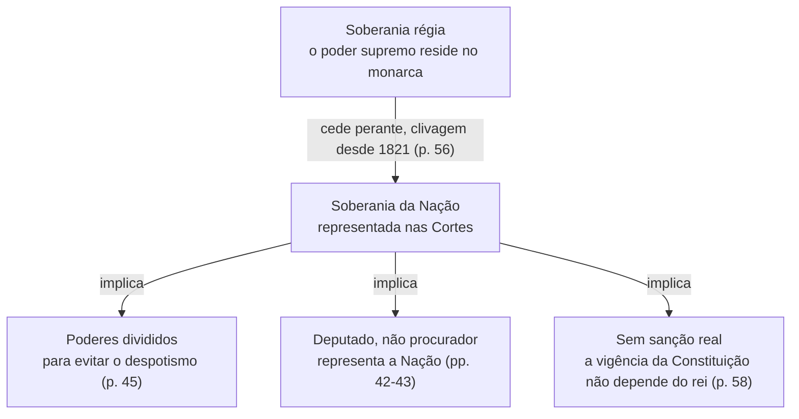

# Anexo A. Modelo da síntese e exemplo completo

### 1. Modelo, rubrica a rubrica

#### Título

O nome do tema, tal como aparece no programa, se existir. Logo abaixo, numa linha, as fontes em que a síntese se baseia (apelido, ano).

#### Contextualização

É a abertura do tema e tem dois momentos. Primeiro, um parágrafo de duas a quatro frases que enquadra o tema historicamente (tempo, espaço e problema que o atravessa), com as palavras-chave a negrito. Pode seguir-se uma frase que diga o que o estudo do tema permite compreender, fazendo a ponte para os objetivos. Depois, a frase "Nesta temática, pretende-se atingir os seguintes objetivos." seguida dos objetivos em tópicos, cada um a começar pelo verbo a negrito ("**Distinguir** ...", "**Explicar** ..."). Se o estudante fornecer os objetivos do programa ou do guia de estudo, usam-se esses. Se não, formulam-se dois a quatro objetivos a partir das fontes e dos núcleos da síntese, com os verbos do anexo B.

#### Desenvolvimento por partes

Uma parte por núcleo, com um título numerado e curto que diga a ideia. Cada parte abre com a frase de orientação ("Nesta primeira parte, importa esclarecer que...") e a ideia principal a negrito, segue-se o parágrafo que a explica e onde entra a citação, depois uma frase de ligação com tópicos e um parágrafo que retoma o raciocínio e faz a ponte para a parte seguinte. Fecha com a nota de atenção, se houver, e com as notas de rodapé da parte, depois de um traço horizontal.

#### Notas de rodapé

Uma nota por conceito-chave ou termo pouco usual, na primeira ocorrência. A definição é a do autor estudado, não uma definição de dicionário, porque o mesmo termo pode ter sentidos diferentes conforme o autor e a época, e leva a referência quando vem da fonte. Quando a fonte não define o termo, a nota dá uma explicação curta e simples, sem a atribuir ao autor.

#### Notas de atenção

Uma nota em itálico, a começar por "Atenção:", no fim da parte onde a confusão pode surgir. Ver o anexo C para os tipos de confusão mais frequentes em História.

#### Cronologia

Rubrica opcional, incluída apenas quando o tema a justificar (ver secção 4). Quando entra, é um quadro com duas colunas (data e acontecimento), apenas com datas que estejam nas fontes e que sejam necessárias para compreender o tema. Num tema historiográfico em que a evolução do debate seja essencial, pode situar autores e obras. Na dúvida, perguntar se o estudante perderia alguma compreensão sem o quadro. Se não perderia, o quadro sai.

#### Esquema-síntese

Um diagrama hierárquico e relacional. No topo o tema, abaixo os núcleos, e depois os aspetos de cada núcleo. As setas têm rótulos que dizem a relação (causa, condição, consequência, contraste, exemplo de, conduz a, opõe-se a). Uma seta sem rótulo ou com um rótulo que o texto não sustenta induz o estudante em erro. O esquema não acrescenta nada que não esteja no desenvolvimento.

#### Essencial a reter

É a síntese da síntese e fecha o tema. Abre com uma frase de ligação e segue-se uma lista estruturada, em regra um tópico por objetivo ou por núcleo, pela mesma ordem, a que se pode juntar um último tópico com o limite mais importante a ter presente. Cada tópico começa por uma etiqueta curta a negrito e condensa numa ou duas frases completas a ideia central e a sua razão, com a referência quando a ideia vier de uma fonte determinada. Não acrescenta nada que não esteja no desenvolvimento e não é telegráfico, porque é a parte que o estudante relê imediatamente antes da avaliação.

#### Referências

Lista em APA 7 das fontes efetivamente usadas.

#### Lacunas (só se existirem)

Breve nota com o que não foi possível confirmar nas fontes (página em falta, conceito pressuposto mas não explicado, data ausente, texto ilegível).

### 2. Exemplo completo (demonstração final)

O exemplo seguinte é uma síntese completa feita com esta skill e serve de modelo de forma, de extensão e de registo. Foi construída a partir de uma única fonte, Homem (s.d.), cujas citações foram conferidas no texto. O seu conteúdo vale apenas como modelo e nunca deve ser reutilizado como fonte de outra síntese, que se constrói sempre com o material fornecido pelo estudante.

Antes de o ler, convém ter presentes os pontos que o exemplo demonstra.

- **Contextualização.** Enquadramento histórico que termina numa frase de ponte, seguido dos objetivos com o verbo a negrito.
- **Partes alinhadas com os objetivos.** Uma parte por objetivo, cada uma aberta por "Nesta primeira parte, importa esclarecer que...", com a ideia principal a negrito logo a seguir.
- **Prosa e tópicos.** Cada parte alterna parágrafos e uma lista anunciada por frase de ligação, e a lista é sempre seguida de prosa que retoma o raciocínio.
- **Acrescentos reconhecíveis pela escrita.** O caso hipotético da parte 2 ("se se imaginar...") e a inferência da parte 3 ("Daqui pode inferir-se...") não têm rótulos, reconhecem-se pela formulação.
- **Fonte primária condensada.** A intervenção do deputado é tratada numa só frase, porque há apenas um documento de época.
- **Notas de atenção e notas de rodapé.** As confusões aparecem em itálico no fim da parte onde surgem, e os conceitos-chave têm nota no fim da respetiva parte.
- **Sem cronologia.** O tema é conceptual e a ordem das datas nada explicaria.

---

**Soberania e divisão de poderes na Constituição de 1822**

Fonte: Homem (s.d.)

**Contextualização**

Quando as Cortes Constituintes[1] começam a trabalhar, em **1821**, a questão decisiva não é apenas a de redigir um texto, mas a de saber **onde reside o poder supremo** e de que modo pode ser impedido de voltar a concentrar-se. A **Constituição de 1822** responde a essa pergunta deslocando a **soberania do rei para a Nação**, o que obriga a repensar, ao mesmo tempo, a organização dos poderes e a natureza da representação política. O estudo do tema permite, assim, compreender que estas três mudanças não são independentes, mas decorrem umas das outras.

Nesta temática, pretende-se atingir os seguintes objetivos.

- **Explicar** a passagem da soberania régia para a soberania da Nação e as tensões que a acompanharam.
- **Relacionar** a divisão de poderes com a recusa do despotismo.
- **Distinguir** a representação política da procuração de direito privado.

---

[1] Cortes Constituintes: assembleia eleita com a função de elaborar a Constituição, que inicia os seus trabalhos em 1821.

**1. A soberania passa para a Nação**

Nesta primeira parte, importa esclarecer que a soberania[2] muda de lugar em relação à situação anterior, em que residia exclusivamente no rei, no quadro da monarquia absoluta. **A mudança essencial da Constituição de 1822 está, por isso, na resposta à pergunta sobre quem detém o poder supremo**, e é dessa resposta que passa a depender toda a ordem política.

Homem mostra que esta deslocação se manifesta em dois planos, que documenta em passagens distintas.

- **No debate de 1821.** O discurso régio lido nas Cortes foi considerado por alguns parlamentares demasiado interventivo e revela já, segundo o autor, a clivagem futura entre a **soberania real** e a **soberania parlamentar**[3] (Homem, s.d., p. 56).
- **No texto constitucional.** Como nota o autor, "**a vigência da Constituição não dependia da sanção real**, isto é, que não se admitia o veto (art. 112.º, I)" (Homem, s.d., p. 58)[4], o que significa que o rei não podia recusar a lei fundamental.

Lidos em conjunto, os dois planos mostram que a soberania da Nação resultou de um confronto, cujo ponto de chegada se mede pela incapacidade do rei de travar a própria lei fundamental. Retirado o poder ao rei, ficava por resolver como impedir que voltasse a concentrar-se noutras mãos.

*Atenção: a passagem sobre a sanção real diz respeito à vigência da Constituição. Não permite concluir, por si só, qual era o papel do rei nas leis ordinárias (Homem, s.d., p. 58).*

---

[2] Soberania: poder supremo, que não depende de nenhum outro e do qual derivam os restantes.

[3] Soberania real e soberania parlamentar: duas respostas opostas à pergunta sobre quem detém o poder supremo, o monarca ou as Cortes que representam a Nação, cuja clivagem o autor deteta já nos debates de 1821 (Homem, s.d., p. 56).

[4] Sanção real e veto: a sanção é a aprovação dada pelo rei a um texto, e o veto é a recusa dessa aprovação, que impede a sua entrada em vigor.

**2. Dividir os poderes para evitar o despotismo**

Nesta segunda parte, importa perceber por que razão não bastava retirar a soberania ao rei. **O perigo não estava na pessoa do monarca, mas na concentração do poder**, e foi esse o argumento do deputado Bento Pereira do Carmo, que, nas palavras citadas por Homem, sustentava que se "acordou em **dividir e equilibrar os três poderes, para evitar o despotismo, que resulta da sua acumulação**" (Carmo, 1821, como citado em Homem, s.d., p. 45).

A frase contém o raciocínio completo da divisão de poderes[5], que se decompõe em dois elementos.

- **A causa do mal.** O despotismo nasce da acumulação dos poderes nas mesmas mãos.
- **O remédio.** A divisão dos poderes, acompanhada do seu equilíbrio, porque dividir sem equilibrar deixaria um deles livre de dominar os outros.

O alcance desta ideia torna-se mais claro se se imaginar um mesmo órgão que fizesse as leis, as executasse e julgasse quem as viola, porque nesse caso nenhuma outra instância poderia travar um abuso seu, e é precisamente esta situação, a de um poder sem contrapeso, que o deputado designa como **despotismo**. Convém, no entanto, ter presente a natureza desta fonte, porque se trata de uma intervenção parlamentar, registada no Diário das Cortes[6] e conhecida aqui através de Homem, que exprime a intenção dos constituintes e não o modo como os poderes vieram a funcionar. Resolvida a questão de como limitar o poder, restava saber em nome de quem os eleitos o exerceriam.

*Atenção: a frase sobre a divisão de poderes pertence a Bento Pereira do Carmo e não a Homem, que a cita como testemunho (Homem, s.d., p. 45). Além disso, mostra o que os constituintes pretendiam e não o modo como os poderes funcionaram na prática.*

---

[5] Divisão de poderes: separação e equilíbrio dos três poderes, justificados nos debates de 1821 pelo facto de a sua acumulação gerar despotismo (Carmo, 1821, como citado em Homem, s.d., p. 45).

[6] Diário das Cortes: publicação onde ficaram registados os debates das Cortes, e que constitui, por isso, uma fonte primária para o estudo do processo constituinte.

**3. Deputados e não procuradores**

Nesta terceira parte, importa mostrar que a nova localização da soberania alterou também o sentido de representar. **Segundo Homem, o vocabulário dos procuradores cede lugar ao dos deputados**, porque a representação política[7] deixa de poder ser entendida como uma procuração de direito privado[8] (Homem, s.d., pp. 42-43). A mudança de palavra traduz, portanto, uma mudança de conceção, e não uma simples atualização de vocabulário.

A diferença entre as duas figuras pode fixar-se do seguinte modo, sendo a primeira caracterização deduzida por contraste com a formulação do autor.

- **Procurador.** Age segundo a lógica de uma procuração de direito privado, isto é, por conta de quem lhe confia o mandato e nos limites desse mandato.
- **Deputado.** Representa a Nação, e a sua representação já não se confunde com essa procuração (Homem, s.d., pp. 42-43).

Daqui pode inferir-se a coerência entre as três partes. Se a soberania pertence à Nação, quem a exerce não pode representar apenas os seus eleitores, mas o conjunto da Nação, o que liga a nova conceção de representação à deslocação da soberania estudada na primeira parte.

*Atenção: procurador e deputado não são sinónimos. A substituição de um termo pelo outro assinala a passagem de uma representação por mandato privado para uma representação da Nação (Homem, s.d., pp. 42-43).*

---

[7] Representação política: relação pela qual o deputado representa a Nação, distinta de uma procuração de direito privado (Homem, s.d., pp. 42-43).

[8] Procuração de direito privado: ato pelo qual alguém autoriza outra pessoa a agir em seu nome e por sua conta, nos limites do mandato conferido.

**Esquema-síntese**

O esquema mostra como a passagem da **soberania régia** para a **soberania da Nação** arrasta consigo as consequências estudadas nas três partes.

**Essencial a reter**

A síntese condensa-se nos pontos seguintes, que retomam os objetivos pela ordem em que foram enunciados.

- **Soberania da Nação.** Com a Constituição de 1822, o poder supremo deixa de residir no rei e passa para a Nação, uma deslocação que gerou tensão desde os debates de 1821 e que culmina na regra de que a vigência da Constituição não dependia da sanção real (Homem, s.d., pp. 56, 58).
- **Divisão de poderes.** Os poderes são divididos e equilibrados porque a sua acumulação gera despotismo, argumento formulado por Bento Pereira do Carmo e documentado, não defendido, por Homem (Carmo, 1821, como citado em Homem, s.d., p. 45).
- **Representação política.** O deputado representa a Nação e não é um procurador de direito privado, mudança que decorre da própria deslocação da soberania (Homem, s.d., pp. 42-43).
- **Limite a ter presente.** As fontes mostram o que se quis e o que se estabeleceu em 1821 e 1822, mas não como os poderes funcionaram na prática nem qual era o papel do rei nas leis ordinárias.

**Referências**

Homem, A. P. B. (s.d.). A Constituição de 1822. Imprensa Nacional. https://imprensanacional.pt/wp-content/uploads/2024/11/O-Essencial-sobre-a-Constituicao-1822_IN.pdf

**Lacunas**

Ficaram por confirmar três pontos, que convém verificar no original.

- **Ano de edição.** O PDF não o indica, pelo que a referência usa s.d.
- **Página incerta.** A passagem sobre a representação política situa-se entre as pp. 42 e 43, sem confirmação da página exata.
- **Fonte indireta.** As palavras de Bento Pereira do Carmo foram lidas apenas através de Homem, sem consulta do Diário das Cortes.
